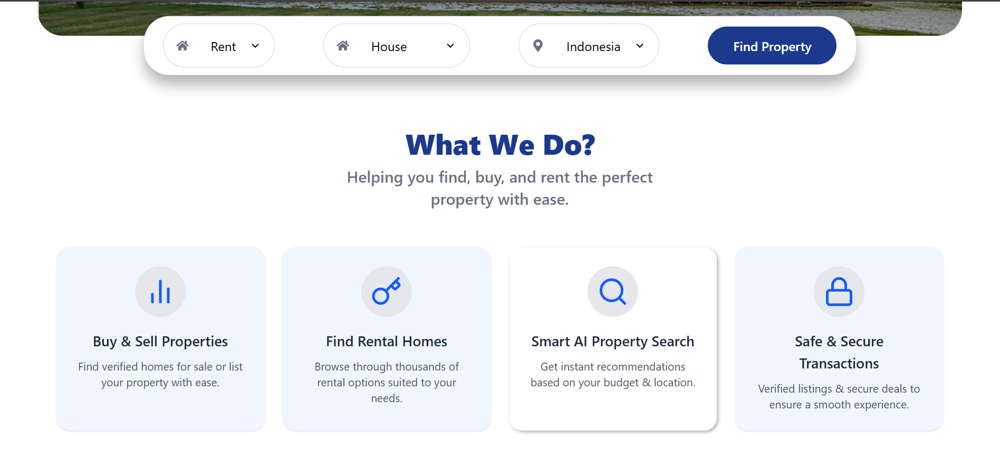
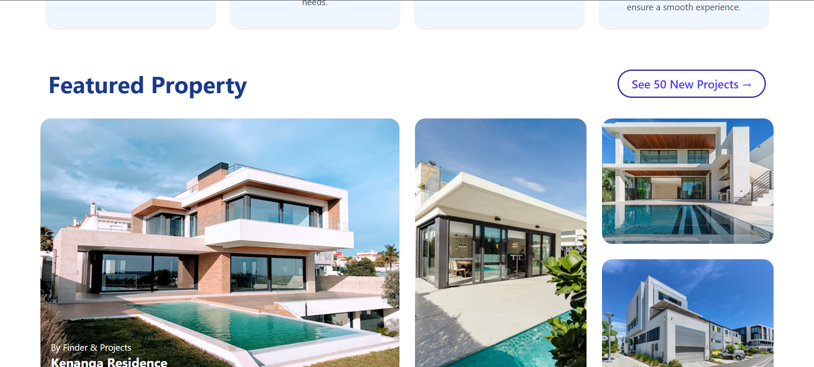
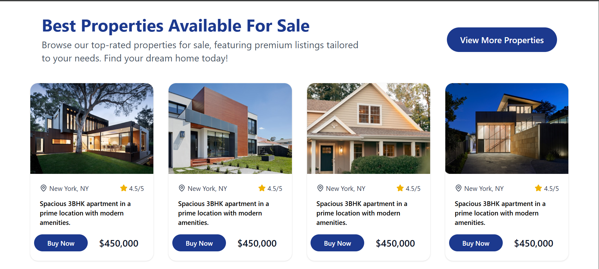
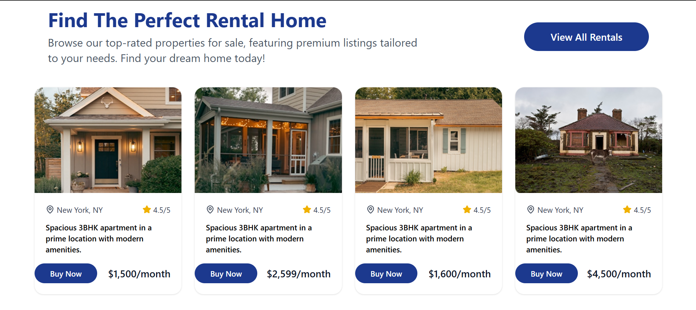
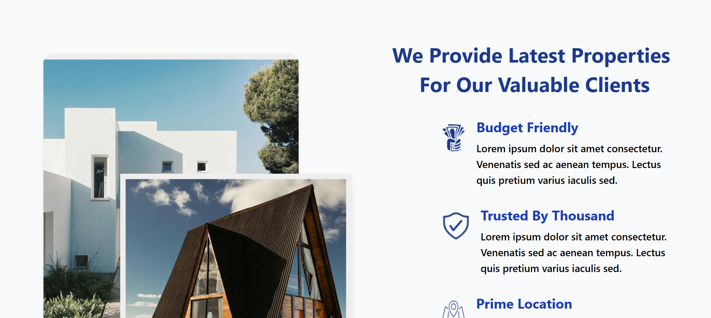
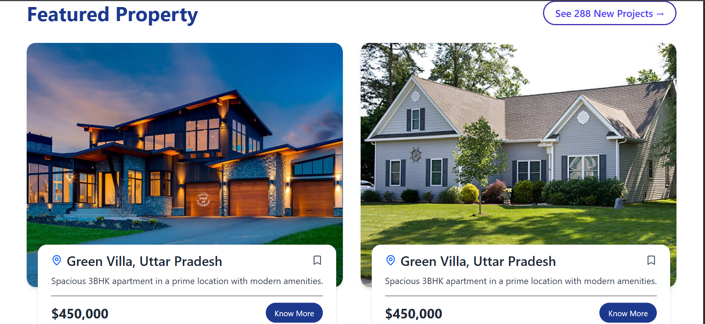

# Real Estate Auth Project

A React app with Firebase Authentication supporting Email/Password, Google, Facebook, and Apple logins. All pages (Home, Listings, Login, Signup) use reusable components.

---

## Setup Instructions
1. Install dependencies:  
2. Start the app:  

---

## Firebase Setup
1. Create a Firebase project at [Firebase Console](https://console.firebase.google.com/).  
2. Enable Authentication → Sign-in methods: Email/Password, Google, Facebook, Apple.  
3. Add your Firebase config to `src/services/firebase.js`:

```js
const firebaseConfig = {
  apiKey: "YOUR_API_KEY",
  authDomain: "YOUR_PROJECT.firebaseapp.com",
  projectId: "YOUR_PROJECT_ID",
  storageBucket: "YOUR_PROJECT.appspot.com",
  messagingSenderId: "YOUR_SENDER_ID",
  appId: "YOUR_APP_ID"
};

## Screenshots
<p align="center">
  
  
  
  
  
  
  
  
  
  
  
  
</p>
